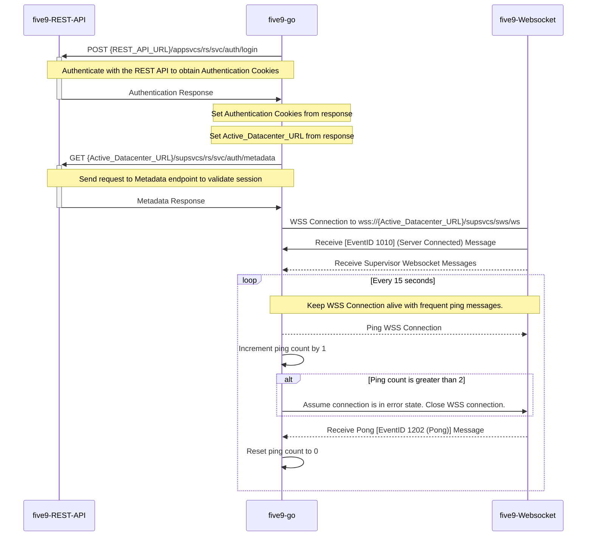

# five9-go

Five9 Client Library for Go

## Documentation Link

https://webapps.five9.com/assets/files/for_customers/documentation/apis/vcc-agent+supervisor-rest-api-reference-guide.pdf

## Basic Sequence Diagram for connecting to Websocket connection

